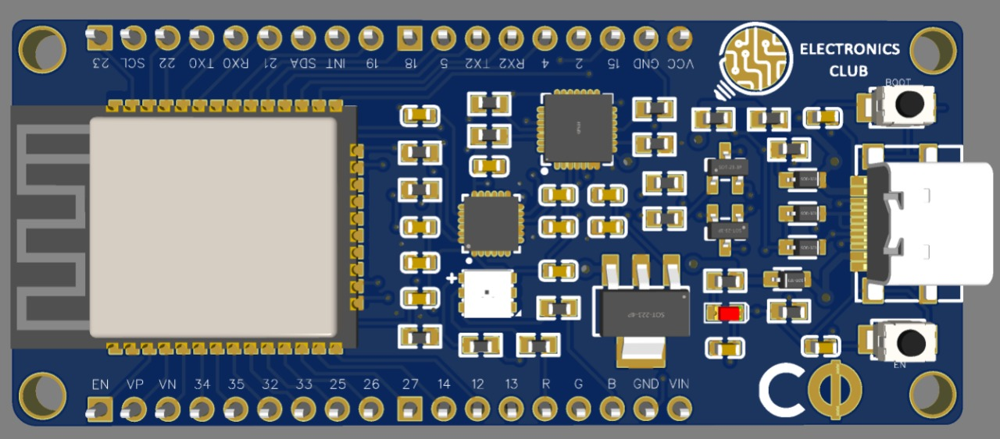
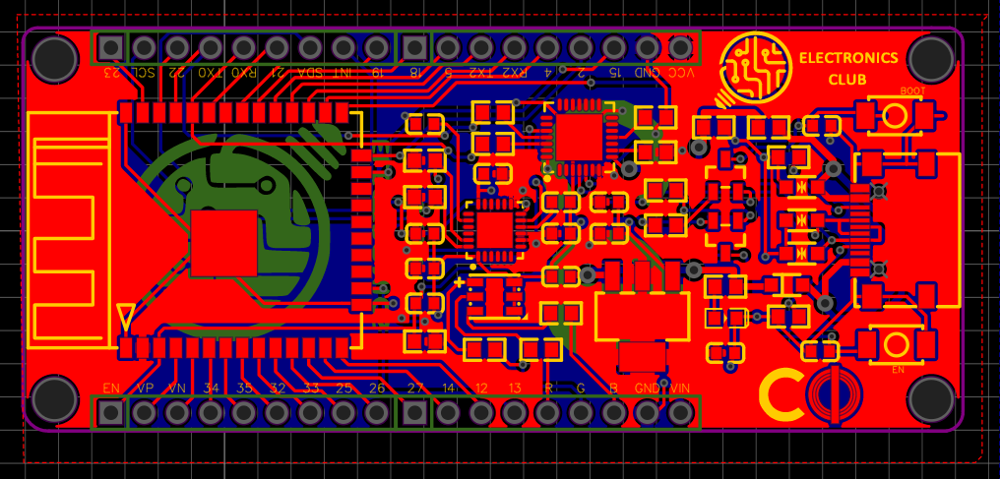

# Custom-Dev-Board
Getting started with the ESP32 based Custom Dev Board     





### Interfacing Custom Dev Board with External CP2102 USB to TTL UART Serial Converter    
#### Connections:        
* VIN of CDB --> External +5V Supply
* GND of CDB --> GND of USB-UART
* TXD of CDB --> RXD of USB-UART
* RXD of CDB --> TXD of USB-UART      
###### Check:
* EN of CDB --> DTR of USB-UART
* D0 of CDB --> RTS of USB-UART

##### References:
[ESP32 with FTDI Programmer](https://electronics.stackexchange.com/questions/448187/esp32-with-ftdi-programmer)       
[ESP Flasher Test Procedure](https://github.com/SuperHouse/ESPF/blob/main/Tests/Test-Procedure.md)

### Programming ESP32 using an Arduino UNO
#### Connections:
* Arduino 5V --> VIN of CDB       
* Arduino GND --> GND of CDB       
* Arduino RX --> RXD of CDB      
* Arduino TX --> TXD of CDB      
* Arduino RESET --> Arduino GND       
* GND --> D0 of CDB
  
Continue by following this [link](https://technoreview85.com/how-to-program-esp-32-cam-using-arduino-uno-board/)       

#### Code for RGB-LED on Custom Dev Board 
* R --> Pin 4             
* G --> Pin 16             
* B --> Pin 17
```
int red = D4;
int green = D16;
int blue = D17;
 
// the setup routine runs once when you press reset:
void setup()
{
// initialize the digital pin as an output.
pinMode(red, OUTPUT);
pinMode(green, OUTPUT);
pinMode(blue, OUTPUT);
digitalWrite(red, HIGH);
digitalWrite(green, HIGH);
digitalWrite(blue, HIGH);
}
 
// the loop routine runs over and over again forever:
void loop() {
digitalWrite(red, LOW); // turn the LED on 
delay(1000); // wait for a second
digitalWrite(red, HIGH); // turn the LED off by making the voltage LOW
delay(1000); // wait for a second
digitalWrite(green, LOW); // turn the LED on 
delay(1000); // wait for a second
digitalWrite(green, HIGH); // turn the LED off by making the voltage LOW
delay(1000); // wait for a second
digitalWrite(blue, LOW); // turn the LED on
delay(1000); // wait for a second
digitalWrite(blue, HIGH); // turn the LED off by making the voltage LOW
delay(1000); // wait for a second
}

```         


### MPU6050 
* SDA of CDB --> Pin 21 of CDB           
* SCL of CDB --> Pin 22 of CDB
```       
#include <Wire.h>
#include <WiFi.h>
const int MPU_addr=0x69;  // I2C address of the MPU-6050
int16_t AcX,AcY,AcZ,Tmp,GyX,GyY,GyZ;
// WiFi network info.
const char *ssid =  "Galaxy-M20";     // Enter your WiFi Name
const char *pass =  "ac312124"; // Enter your WiFi Password
WiFiServer server(80);
void setup(){
 Serial.begin(115200);
 Wire.begin();
 Wire.beginTransmission(MPU_addr);
 Wire.write(0x6B);  // PWR_MGMT_1 register
 Wire.write(0);     // set to zero (wakes up the MPU-6050)
 Wire.endTransmission(true);
 Serial.println("Wrote to IMU");
  Serial.println("Connecting to ");
  Serial.println(ssid);
  WiFi.begin(ssid, pass);
  while (WiFi.status() != WL_CONNECTED)
  {
    delay(500);
    Serial.print(".");              // print ... till not connected
  }
  Serial.println("");
  Serial.println("WiFi connected");
  Serial.println("IP address is : ");
  Serial.println(WiFi.localIP());
  server.begin();
  Serial.println("Server started");
}
void loop(){
mpu_read();
WiFiClient client = server.available();
 if (client) 
  {                             
    Serial.println("new client");          
    String currentLine = "";                   //Storing the incoming data in the string
    while (client.connected()) 
    {            
      if (client.available())                  //if there is some client data available
      {                
        char c = client.read();                // read a byte
          if (c == '\n')                       // check for newline character, 
          {                     
          if (currentLine.length() == 0)      //if line is blank it means its the end of the client HTTP request
          {     
            client.print("<html><title> ESP32 WebServer</title></html>");
            client.print("<body bgcolor=\"#E6E6FA\"><h1 style=\"text-align: center; color: blue\"> ESP32 WebServer </h1>");
            client.print("<p style=\"text-align: left; color: red; font-size:150% \">Accelerometer Values: ");
            client.print("<p style=\"text-align: left; font-size:150% \">AcX: ");
            client.print(AcX);
            client.print("<br/>AcY: ");
            client.print(AcY);
            client.print("<br/>AcZ: ");
            client.print(AcZ);
            client.print("<p style=\"text-align: left; color: red; font-size:150% \">Gyroscope Values: ");
            client.print("<p style=\"text-align: left; font-size:150% \">GyX: ");
            client.print(GyX);
            client.print("<br/>GyY: ");
            client.print(GyY);
            client.print("<br/>GyZ: ");
            client.print(GyZ);
            client.print("</p></body>");        
            break;  // break out of the while loop:
          } 
           else
          {    // if you got a newline, then clear currentLine:
            currentLine = "";
          }
         } 
         else if (c != '\r') 
         {  // if you got anything else but a carriage return character,
          currentLine += c;       // add it to the end of the currentLine
         }
        }
      }
  }
}
void mpu_read(){
 Wire.beginTransmission(MPU_addr);
 Wire.write(0x3B);  // starting with register 0x3B (ACCEL_XOUT_H)
 Wire.endTransmission(false);
 Wire.requestFrom(MPU_addr,14,true);  // request a total of 14 registers
 AcX=Wire.read()<<8|Wire.read();  // 0x3B (ACCEL_XOUT_H) & 0x3C (ACCEL_XOUT_L)
 AcY=Wire.read()<<8|Wire.read();  // 0x3D (ACCEL_YOUT_H) & 0x3E (ACCEL_YOUT_L)
 AcZ=Wire.read()<<8|Wire.read();  // 0x3F (ACCEL_ZOUT_H) & 0x40 (ACCEL_ZOUT_L)
 //Tmp=Wire.read()<<8|Wire.read();  // 0x41 (TEMP_OUT_H) & 0x42 (TEMP_OUT_L)
 GyX=Wire.read()<<8|Wire.read();  // 0x43 (GYRO_XOUT_H) & 0x44 (GYRO_XOUT_L)
 GyY=Wire.read()<<8|Wire.read();  // 0x45 (GYRO_YOUT_H) & 0x46 (GYRO_YOUT_L)
 GyZ=Wire.read()<<8|Wire.read();  // 0x47 (GYRO_ZOUT_H) & 0x48 (GYRO_ZOUT_L)
 Serial.print("Accelerometer Values: \n");
 Serial.print("AcX: "); Serial.print(AcX); Serial.print("\nAcY: "); Serial.print(AcY); Serial.print("\nAcZ: "); Serial.print(AcZ);   
 //Serial.print("\nTemperature: " );  Serial.print(Tmp);
 Serial.print("\nGyroscope Values: \n");
 Serial.print("GyX: "); Serial.print(GyX); Serial.print("\nGyY: "); Serial.print(GyY); Serial.print("\nGyZ: "); Serial.print(GyZ);
 Serial.print("\n");
 delay(3000);
 }     
 
 ```     
* [Reference](https://circuitdigest.com/microcontroller-projects/mpu6050-gyro-sensor-interfacing-with-esp32-nodemcu-board)      

#### On Arduino IDE:
* Open Arduino IDE on your PC --> File --> Preferences -->     
* Paste this in Board Manager URL "https://dl.espressif.com/dl/package_esp32_index.json"        
* Now, Tools --> Board --> Board manager > Search for ESP32         
* Download & install the latest version package            
* Select board to "ESP32 Dev Module" for the CDB in the Board option

## Designed by
- J Phani Jayanth 
- Sharanesh R
